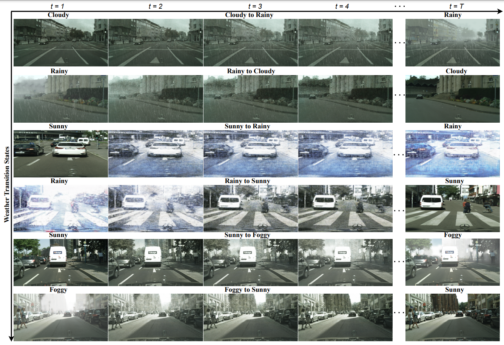
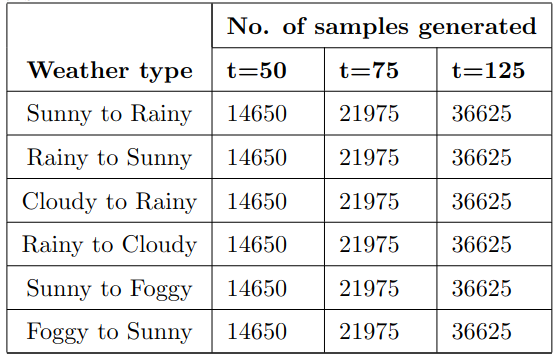
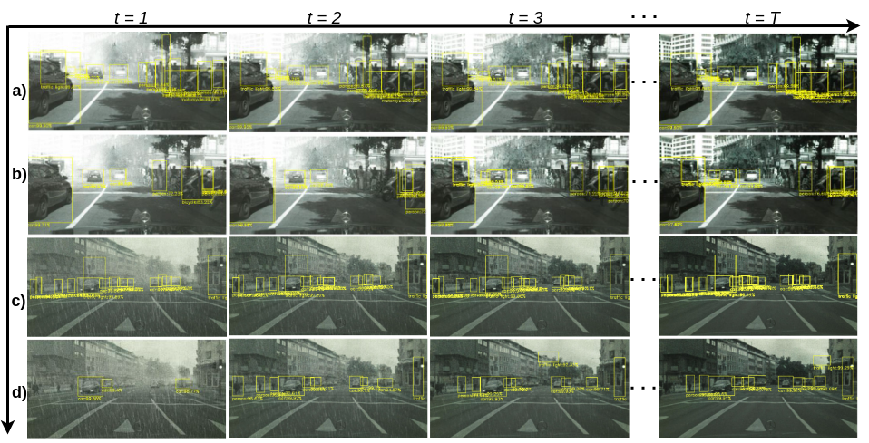

# AIWD6-dataset
## Dataset for capturing continuous weather scenarios
We introduce a large-scale comprehensive dataset known as the Adverse Intermediate Weather Driving (AIWD6) dataset. This dataset comprises six transitional weather states designed for autonomous driving scenarios: cloudy to rainy, rainy to cloudy, sunny to rainy, rainy to sunny, sunny to foggy, and foggy to sunny. These transitional states are generated at various temporal scales. Further, we propose an approach to classify the transitional weather images using a gated recurrent unit (GRU). We anticipate that our dataset with realistic continuous weather shifts will shape the data collection paradigm for real-world driving datasets and advance scene perception techniques for AVs.

AIWD6 dataset can be downloaded (https://iith-my.sharepoint.com/:u:/g/personal/cs21resch15001_iith_ac_in/Edk5fALBsylKutRXkgchuXoBKlUOgv50W3BGBw_U8S5Qsg?e=9MhTZ4)

The overall breakdown of the AIWD6 dataset is given below, where the number of input samples for each discrete weather condition is 293.

## Object Detection

We have manually annotated the AIWD6 dataset to perform object detection.

<h2> License </h2>

This dataset is provided for academic and research purposes only.

<h2> Citation</h2>

If you use this dataset, consider citing our papers.

@ARTICLE{10323218,
  author={Kondapally, Madhavi and Kumar, K. Naveen and Vishnu, Chalavadi and Mohan, C. Krishna},
  journal={IEEE Transactions on Intelligent Transportation Systems}, 
  title={Towards a Transitional Weather Scene Recognition Approach for Autonomous Vehicles}, 
  year={2024},
  volume={25},
  number={6},
  pages={5201-5210},
  keywords={Clouds;Logic gates;Data collection;Feature extraction;Data mining;Convolutional neural networks;Atmospheric measurements;Weather forecasting;Autonomous vehicles;interpolation;weather transition states;spatio-temporal features;sequence classification},
  doi={10.1109/TITS.2023.3331882}}
  
@INPROCEEDINGS{10651445,
  author={Kondapally, Madhavi and Kumar, K Naveen and Krishna Mohan, C},
  booktitle={2024 International Joint Conference on Neural Networks (IJCNN)}, 
  title={Object Detection in Transitional Weather Conditions for Autonomous Vehicles}, 
  year={2024},
  volume={},
  number={},
  pages={1-8},
  keywords={Measurement;Adaptation models;Clouds;Object detection;Transformers;Data models;Object recognition;Autonomous vehicles;transitional weather states;object detection;domain adaptation},
  doi={10.1109/IJCNN60899.2024.10651445}}

